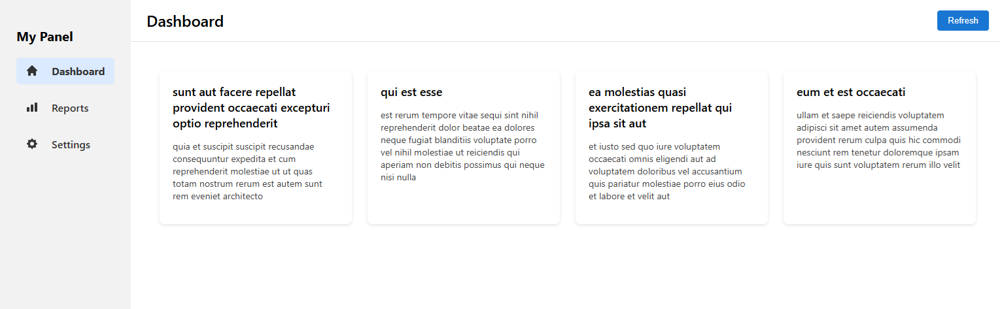

# **React Dashboard — (JavaScript Version)**

A simple and clean dashboard built with **React**, **Custom Hooks**, **Routing**, and a fully responsive UI. The dashboard fetches real API data and displays it using reusable components.

---

## 🚀 **Demo**
👉 **https://dashboard-nu-jade-21.vercel.app/**

---

## 📌 **Features**
- Fully responsive dashboard layout (mobile → tablet → desktop)
- Sidebar navigation with **active highlight state**
- Header with Refresh button
- Page routing with **React Router**
- Beautiful icons using **react-icons**
- Fetching real API data using a custom hook (`useFetch`)
- Displaying posts in card components
- Reusable Layout component for consistent structure
- Organized and scalable folder structure
- Fully deployed on Vercel

---

## 🧱 **Tech Stack**
- React (JavaScript)
- React Router
- React Icons
- CSS (modular component styles)
- Fetch API
- Vercel Deployment

---

## 📂 **Project Structure**
```text
src/
├── components/
│   ├── Sidebar.jsx
│   ├── Header.jsx
│   └── Card.jsx
│
├── pages/
│   ├── Dashboard.jsx
│   ├── Reports.jsx
│   └── Settings.jsx
│
├── hooks/
│   └── useFetch.js
│
├── styles/
│   ├── Card.css
│   ├── Dashboard.css
│   ├── Header.css
│   └── Sidebar.css
│
├── layout/
│   └── Layout.jsx
│
├── App.js
└── index.js

---

## 🛠️ **How to Run Locally**
```bash
git clone https://github.com/Molana2022/dashboard.git
cd dashboard
npm install
npm start
```
---

## 📡 **API Source**
Data fetched from:
[https://jsonplaceholder.typicode.com/posts](https://jsonplaceholder.typicode.com/posts)

---

## 📸 **Screenshot (UI Preview)**


---

## ✔️ **License**
This project is open source and available under the MIT License.

